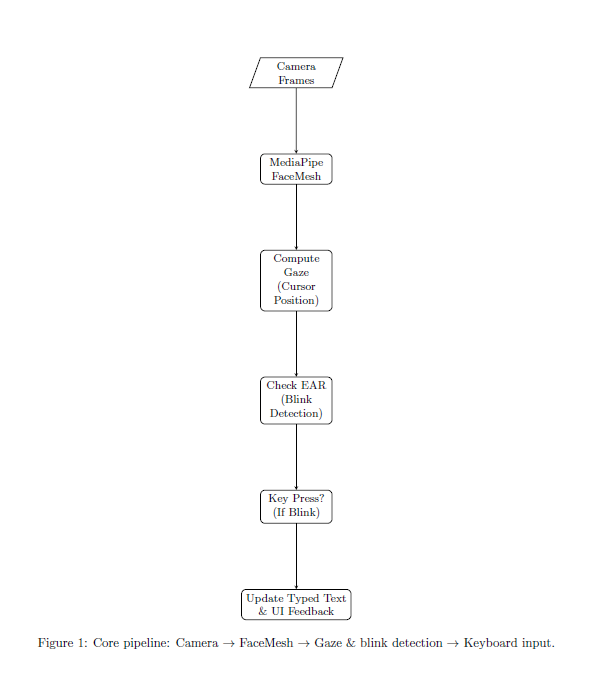
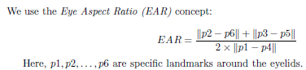

# Eye-Tracking Keyboard Using a Webcam

This project introduces a simple yet effective eye-tracking text-entry system powered by a standard webcam and MediaPipe FaceMesh. By estimating the user's gaze on an on-screen keyboard and detecting blinks via the Eye Aspect Ratio (EAR), the interface enables hands-free typing. 

For a deployed demo, please visit this [Link](https://eye-tracking-7poqps5eq-stahmir79gmailcoms-projects.vercel.app/)
the demo may show slower performance compared to a local deployment.

## Features

- Real-time detection of facial landmarks using MediaPipe FaceMesh.
- Conversion of landmark positions into a 2D on-screen cursor.
- Blink-based text input using the Eye Aspect Ratio (EAR).
- Customizable parameters, such as blink thresholds and cooldown times.
- Deployment-ready in Next.js.

## Features

- Real-time detection of facial landmarks using MediaPipe FaceMesh.
- Conversion of landmark positions into a 2D on-screen cursor.
- Blink-based text input using the Eye Aspect Ratio (EAR).
- Customizable parameters, such as blink thresholds and cooldown times.
- Deployment-ready in Next.js.

## Workflow


## Key Parameters

### EAR Threshold
Defines when a blink is registered. Default: `0.25`.
- Adjust between `0.20` and `0.30` based on user preferences.

<<<<<<< HEAD
### Cooldown Time
Prevents multiple key presses during a single prolonged blink. Default: `1000 ms`.

### Gaze Scale
Maps small eye movements to broader on-screen cursor movements. Default: `5.0`.

## Example Code Snippets

=======



### Cooldown Time
Prevents multiple key presses during a single prolonged blink. Default: `1000 ms`.

### Gaze Scale
Maps small eye movements to broader on-screen cursor movements. Default: `5.0`.

## Example Code Snippets

>>>>>>> 184a86f7cabe71bd3d99e6a7cafed1ebedbff0ed
### States and Parameters in `page.js`
```javascript
export default function Home() {
  const videoRef = useRef(null);
  const canvasRef = useRef(null);

  const [cursorPosition, setCursorPosition] = useState({x: 0, y: 0});
  const [typedText, setTypedText] = useState('');
  const [isShiftActive, setIsShiftActive] = useState(false);
  const [hoveredKey, setHoveredKey] = useState(null);

  const cooldownRef = useRef(false);

  const EAR_THRESHOLD = 0.25;   // Blink detection
  const GAZE_SCALE = 5.0;       // Cursor sensitivity
  const BLINK_COOLDOWN = 1000;  // in ms
}
```

### Eye Aspect Ratio and Blink Detection
```javascript
function checkBlink(earLeft, earRight) {
  if (earLeft < EAR_THRESHOLD || earRight < EAR_THRESHOLD) {
    return true;
  } else {
    return false;
  }
}
```

### Cooldown Mechanism
```javascript
if (!cooldownRef.current) {
  // Perform keypress actions here...

  cooldownRef.current = true;
  setTimeout(() => {
    cooldownRef.current = false;
  }, BLINK_COOLDOWN); // e.g., 1000 ms
}
```

## Deployment in Next.js

- **Client-Side Rendering (CSR):** Ensures webcam input and face-tracking run in the browser.
- **Hosting:** Use platforms like Vercel or AWS Amplify for deployment.
- **HTTPS Requirement:** Browsers require secure connections for camera access.

## User Tips

1. **Adjust EAR Threshold:** Test values between `0.20` and `0.30`.
2. **Modify Cooldown Time:** Prevent accidental multiple presses.
3. **Check Lighting Conditions:** Ensure uniform lighting for better tracking.
4. **Gaze Calibration:** Map gaze extremes accurately to the on-screen cursor.

## Future Enhancements

- **Adaptive Calibration:** Dynamically adjust gaze-to-cursor mapping.
- **Lighting Robustness:** Improve landmark stability under varying lighting.
- **Advanced Layouts:** Multi-language keyboards and predictive text.
- **Hybrid Control:** Combine speech recognition with eye-tracking.

## License
This project is open-source and licensed under the [MIT License](LICENSE).

## Acknowledgments
Special thanks to MediaPipe for their open-source FaceMesh framework and the Next.js community for their support in deployment and integration.

---

For more details and technical documentation, visit the project repository or contact the maintainer.
